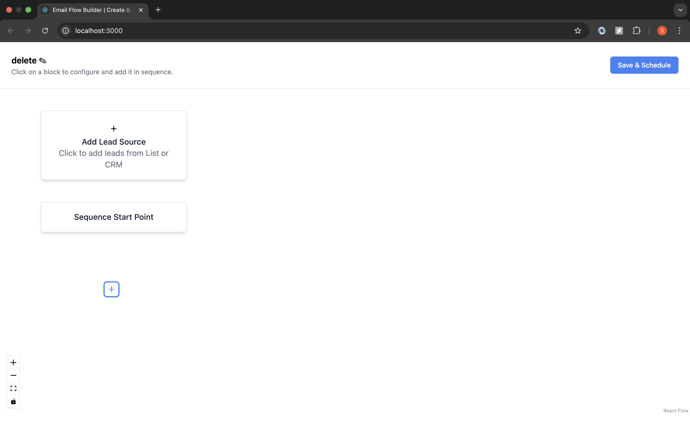
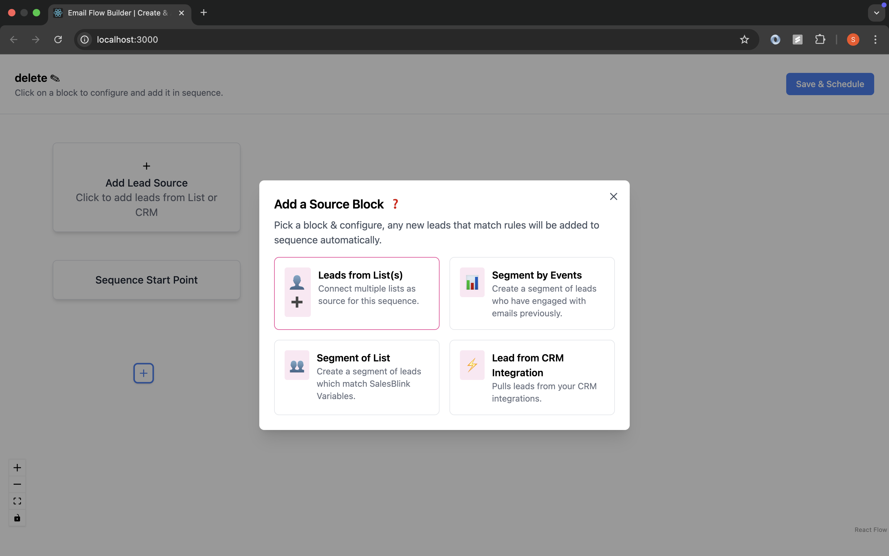

# [FlowMail](<(https://client-three.vercel.app)>)

## 📌 Introduction

[](https://awesome.re)

This is a full-stack application that allows users to visually design and implement an email marketing sequence using a drag-and-drop interface. Built with the **MERN stack**, it uses **React Flow** for the flowchart UI and **Agenda + Nodemailer** on the backend for email scheduling and delivery.

## 👨‍💻 Tech Stack Used

| Frontend  | Backend    | Database | Scheduler | Email Sender |
| --------- | ---------- | -------- | --------- | ------------ |
| React.js  | Node.js    | MongoDB  | Agenda.js | Nodemailer   |
| ReactFlow | Express.js | Atlas    |           |              |

## ✨ Features

### Frontend (React + React Flow)

- ✍️ Editable Node Fields (email subject/body, wait duration, etc.)
- 🔗 Connect nodes with edges
- 💾 Save Flow to backend
- ✅ JWT Authentication (Login/Register)

## 🛠️ Installation Steps

Star and Fork the Repo 🌟 and this will keep us motivated.

1. Clone the repository

```bash
git clone https://github.com/subhashdippu/Backend-engin.git
```

2. Change the working directory

```bash
cd FlowMail
```

3. Install dependencies

```bash
npm install
```

4. Run the app

```bash
nodemon npm start
```

## 📸 Screenshots



